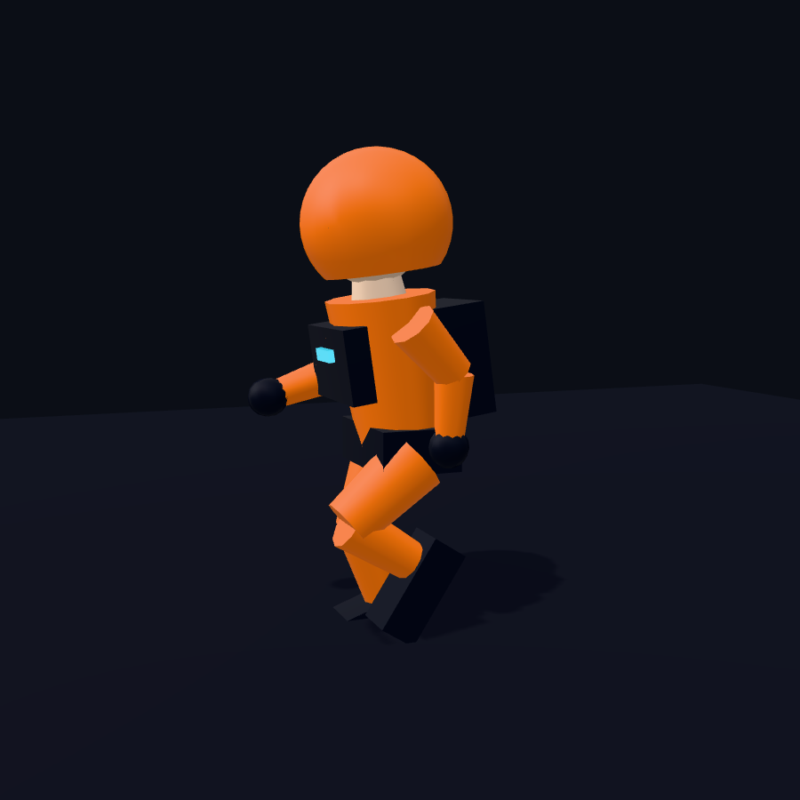
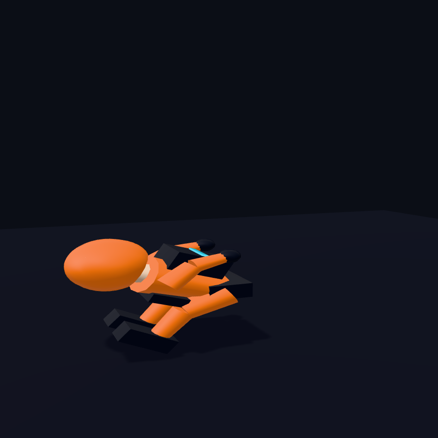
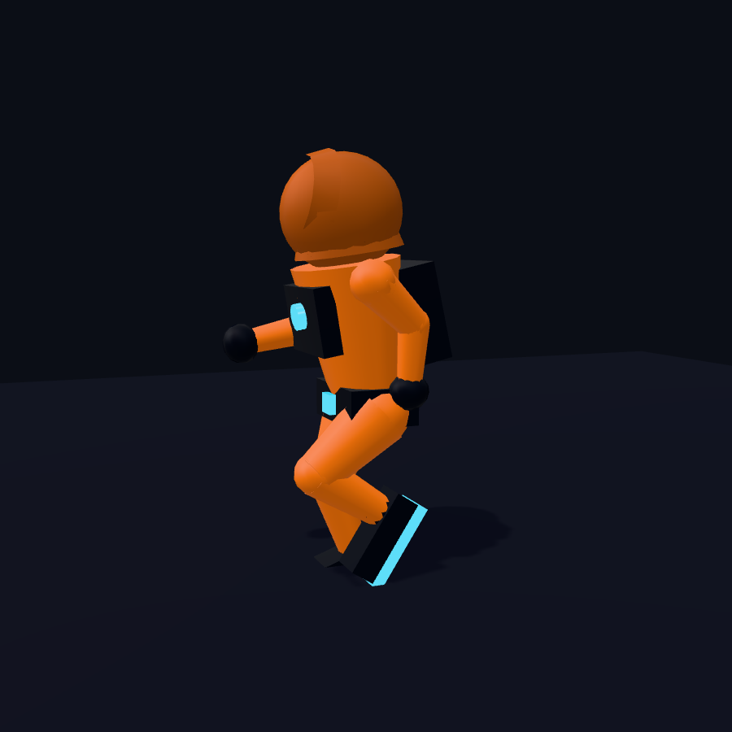
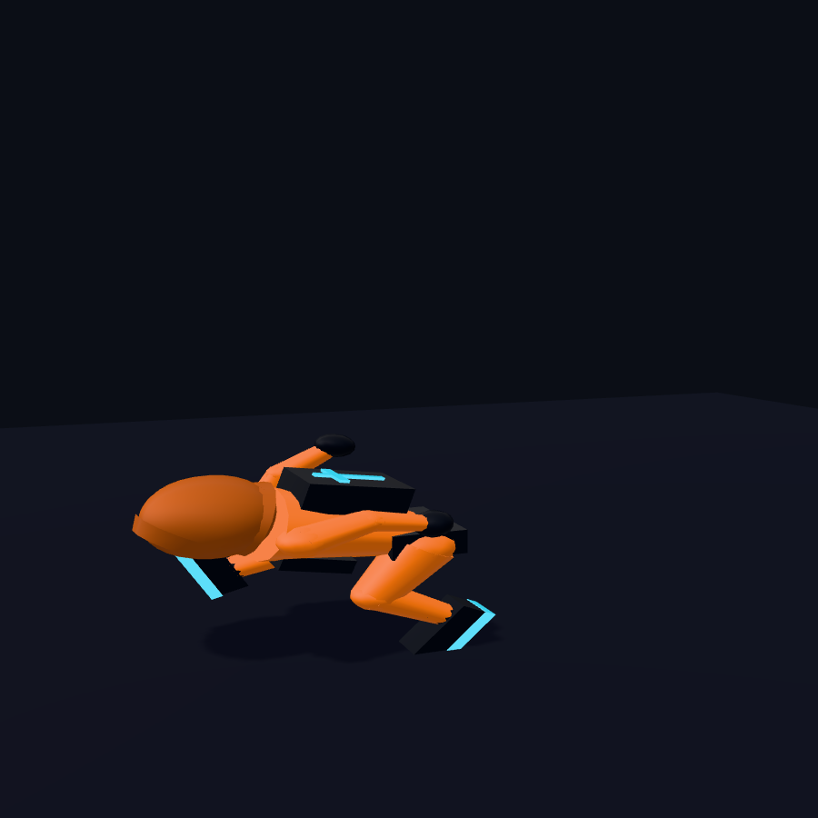
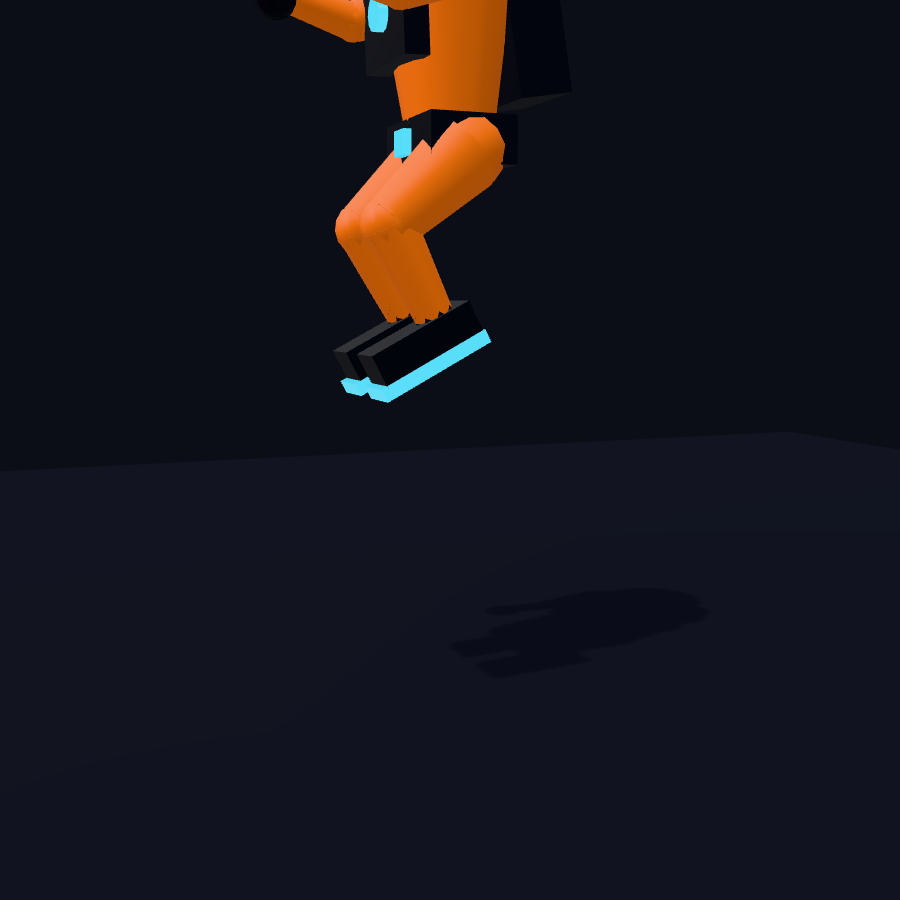
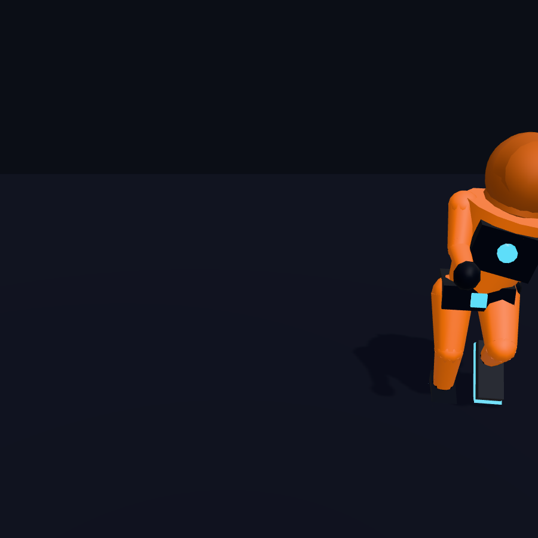
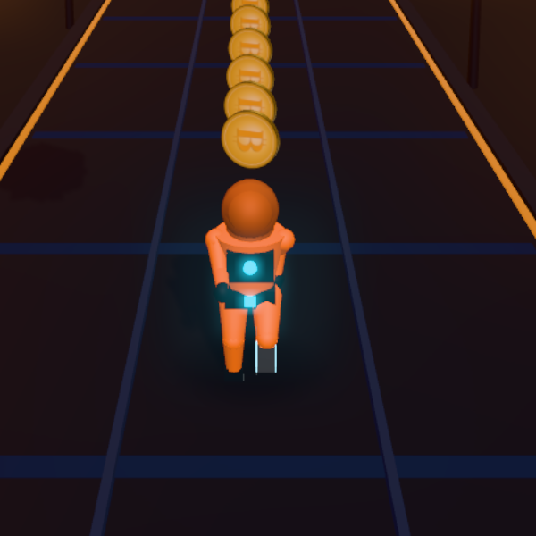
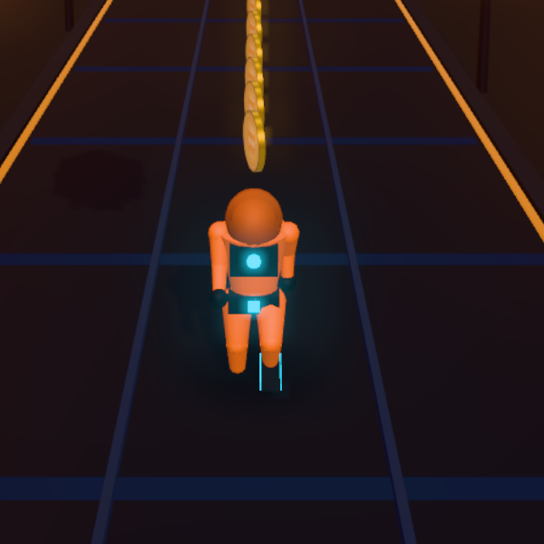
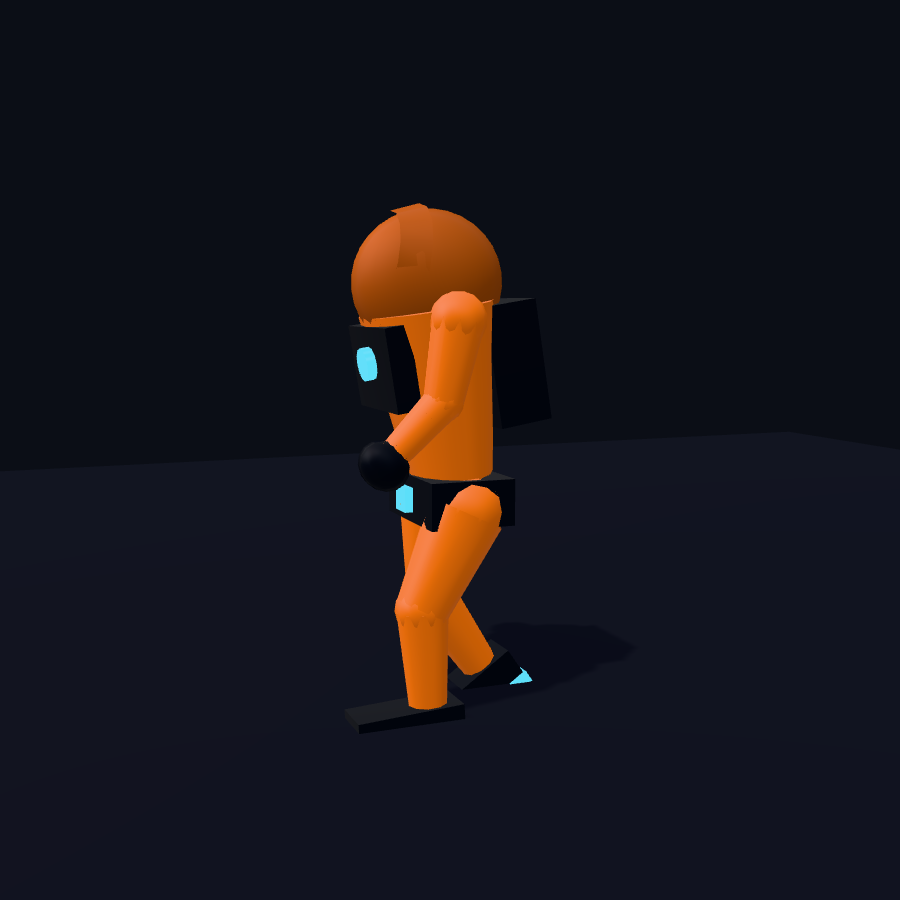

# Hero character — SAT, the hooded Arch courier

How the hero (the player's runner) is built, animated, and swappable. This covers the two
hero implementations that ship, the honest asset provenance, the clip list, the fallback
chain, and how it was verified in-browser.

See also `docs/GAMEDEV_RESEARCH_AND_REVAMP.md` §3 (Path A / Path B).

---

## TL;DR

- **Default hero = a substantially upgraded PROCEDURAL rig** (`src/game/runner-rig.ts`, "Path A").
  No download, instant, responsive, deterministic-safe. This is the verified, shipped default.
- **Opt-in hero = a rigged GLB** (`src/game/hero-glb.ts` + `src/assets/hero-courier.glb`,
  "Path B"): `GLTFLoader` + `AnimationMixer`, crossfaded clips, code-split, CSP-safe, with the
  procedural rig as an automatic fallback if the asset fails to load.
- **Honest provenance:** external 3D-asset generation was **NOT available** on this machine, so
  the GLB is **procedurally authored by us (CC0)** — it is *not* a pro / scanned / Mixamo asset.
  It makes the Path B pipeline real and testable and is the drop-in slot for a true premium
  hero later. See **Asset provenance** below.

---

## Why not a "premium" pro/generated asset

The `threejs-game-director` credential probe
(`~/.claude/skills/threejs-game-director/scripts/probe_asset_credentials.sh`) reported:

```
TRIPO_API_KEY=MISSING
GEMINI_API_KEY=MISSING
ELEVENLABS_API_KEY=MISSING
```

So there was **no generator** (Tripo for 3D, Gemini for textures). The research's Path B
"premium" target also depends on **Mixamo** clips, which are login-gated (Adobe account) and not
CC0, so they can't be fetched headlessly or shipped. No suitable free CC0 asset matches the
"hooded Arch courier" identity without heavy rework either.

Per the task's own decision tree this routes to a **substantial procedural upgrade** (Path A) as
the primary deliverable. We *also* built the full Path B pipeline and authored our own rigged
GLB so the GLB path is genuine, integrated, and tested — just honestly labelled as a procedural
placeholder, not a pro asset.

**To upgrade to a true premium hero:** drop a rigged humanoid GLB (clips named
`idle` / `run` / `jump` / `slide`, materials named `suit*` / `gear*` / `visor|core|accent` /
`*hood*`) at `src/assets/hero-courier.glb`, set the hero model to `glb` (below), and it will be
used automatically. Or set `TRIPO_API_KEY` and regenerate from a generator.

---

## The interface contract (both heroes implement it)

`render.ts` drives the hero through one small interface (`Hero` in `render.ts`), so either
implementation drops in unchanged:

```ts
type Hero = {
  readonly group: THREE.Group;
  update(st: { x; y; sliding; grounded; phase; emissive }): void;
  setColor(hex: number): void;        // live character-colour change
  setColorObj(c: THREE.Color): void;  // per-frame colour (Block/Flip tints) — no allocation
};
```

`render.ts` also sets `rig.group.rotation.x` (stumble lean) and reads `rig.group` for shadows;
both heroes honour that.

---

## Path A — the procedural rig (`src/game/runner-rig.ts`, default)

A fully authored jointed character (not stacked boxes): athletic tapered torso, a **distinct
dark cowl hood** with a forward brim and a glowing cyan visor over a shadowed face, a
**ledger-pack** on the back, jointed tapered limbs with **overlapping joint caps** (no gaps),
boots with lit soles, and a glowing chest core. Material zones: suit (player colour) / dark gear
/ in-cowl shadow / emissive accent.

**What this pass added over the previous greybox rig** (the Path A work from the research):

- **Better silhouette/proportions** — smaller head, athletic torso taper, and a **cowl that
  reads as a hood** (a darker shade of the suit with a brim) instead of a bald orange sphere.
- **No joint gaps** — sphere caps at every hip/knee/shoulder/elbow so limbs read continuous.
- **Secondary motion** — the cowl and the ledger-pack **lag and sway** on jumps, landings, and
  lane changes (critically-damped springs, velocity-driven, no physics engine).
- **Turn-lean** — the body banks and the figure yaws into a lane change.
- **Crisper jump** — anticipation **reach** on the rise → knee **tuck** + arms-forward on the
  fall (driven by vertical velocity), not one static tuck.
- **Dynamic slide** — a **baseball dive**: leading leg extended, trail leg tucked, torso dive.
- Kept the existing **2-bone foot-IK** run cycle and the exact public interface.

Determinism is untouched: `update()` derives velocities from per-frame state deltas; this is
pure presentation (the sim remains the authority). No per-frame allocation.

### Before → after (Path A)

| | Run (side) | Slide (side) |
|---|---|---|
| **Before** |  |  |
| **After**  |    |   |

Jump (rise-reach → tuck) and turn-lean, after:

 

In-engine (real renderer, behind-above camera, the view players actually see):



---

## Path B — the rigged GLB hero (`src/game/hero-glb.ts`, opt-in)

`HeroGLB` is the premium-pipeline wrapper:

1. On construction it instantiates the procedural `RunnerRig` and shows it **immediately** (hero
   visible on frame 1).
2. It kicks off an **async GLB load** from a **same-origin** URL (Vite's asset pipeline rewrites
   `new URL("../assets/hero-courier.glb", import.meta.url)` to a hashed file the app serves
   itself — **CSP-safe**, never a CDN).
3. On success it swaps the skinned GLB in and drives it with one **`AnimationMixer`**,
   crossfading between `idle` / `run` / `jump` / `slide` (`crossFadeTo(…, 0.16, true)` with both
   actions live during the blend; `clampWhenFinished` + `LoopOnce` on the jump one-shot). Run
   playback speed is matched to the gait phase so feet don't slide. In-place safety: any residual
   root-translation track is stripped so clips never teleport.
4. On **any failure** (offline, 404, bad asset, blocked) it silently keeps the procedural rig.

Compression: the loader wires `MeshoptDecoder` (bundled, inline wasm — no external fetch). The
shipped asset is currently uncompressed geometry; run it through `gltf-transform`/`gltfpack`
(Meshopt) when size matters.

In-engine with `?hero=glb` (skinned GLB, baked run clip, in the real renderer):



Isolated (side) — note the darker cowl + brim and skinned limbs:



---

## The shipped GLB asset

- **Path:** `src/assets/hero-courier.glb` (bundled by Vite → served same-origin, CSP-safe).
- **Size:** ~192 KB (uncompressed; ~21 KB gzip for the loader chunk, asset ships as-is).
- **Contents:** 12-bone skeleton, 1 `SkinnedMesh`, ~2.4k verts, 4 materials (suit / gear /
  visor+core / hood), **4 animation clips**: `idle`, `run`, `jump` (one-shot), `slide` (one-shot).
- **License:** **CC0 / public domain** — authored by this project (procedurally generated), no
  third-party content. **Not** a Mixamo / scanned / store asset.
- **Regenerate:** `node scripts/build-hero-glb.mjs` (uses `three`'s `GLTFExporter`; re-samples the
  clip poses from the same gait math as the procedural rig).

---

## Choosing the hero model

Presentation-only setting in `src/game/settings.ts`:

- `heroModel()` → `"procedural"` (default) or `"glb"`.
- `setHeroModel("glb" | "procedural")` — persists per device (`localStorage`).
- URL override for testing: **`?hero=glb`** (or `?hero=procedural`).

`render.ts` constructs the procedural rig synchronously, and if the model is `glb` it
**dynamically imports** `HeroGLB` (code-split: `GLTFLoader` + decoder load only when selected —
the default bundle stays lean) and swaps it in.

---

## Verification

Verified in-browser with **Playwright (channel `chrome`, SwiftShader)** at 2 effort levels:

1. An **isolated hero harness** rendering fixed poses (run/jump/slide/turn/idle) of each hero
   against game-matched lighting + IBL — for silhouette/pose inspection.
2. A **real-`Renderer` harness** driving the actual in-game pipeline (IBL env, shadows, bloom,
   city, the real behind-above camera) for both `procedural` and `?hero=glb` — **zero page
   errors on both**, hero reads correctly from behind, GLB loads + animates + crossfades, and
   the procedural fallback is never empty.

Guardrails held: `tsc -b` clean, `vite build` green (GLB bundled, `hero-glb` code-split),
**57/57 tests pass**, determinism unchanged (renderer stays presentation-only).

> The harness files were temporary and removed after capture; the screenshots above live in
> `docs/hero/`. Re-create a harness that imports `runner-rig.ts` / `hero-glb.ts` to re-shoot.
